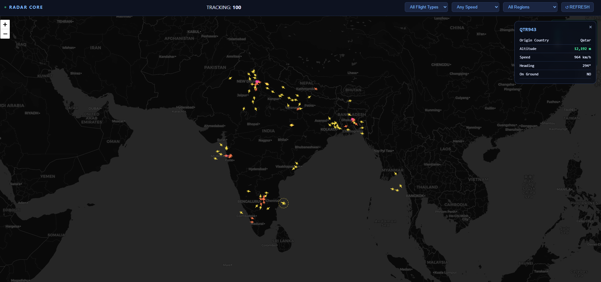

# ✈️ SkyRadar — React Frontend

> The SkyRadar frontend is a React 18 single-page application built on Vite, responsible for consuming the FastAPI flight data layer and rendering a live, interactive radar map. It features a Leaflet.js canvas map with dynamically rotated SVG aircraft icons, sidebar filter controls, and a telemetry detail panel — all coordinated through a single global polling state loop in `App.jsx`.

---

 edit

## 📁 Project Structure

```
frontend/
│
├── index.html              # Base HTML skeleton — Vite's single entry point
├── vite.config.js          # Vite compilation & dev server configuration
├── package.json            # Locked dependency versions (React 18, Leaflet)
│
└── src/
    ├── main.jsx            # React DOM entry point — mounts <App /> into #root
    ├── App.jsx             # Global state coordinator & API polling hook
    ├── index.css           # Global layout, reset, and base styling rules
    │
    └── components/
        ├── FlightMap.jsx   # Advanced Leaflet Canvas map with rotated SVG icons
        ├── ControlPanel.jsx # Sidebar filters — Speed, Country, On-Ground status
        └── InfoPanel.jsx   # Detailed flight telemetry viewer (click-to-inspect)
```

---

## 🧩 Component Architecture

```
┌─────────────────────────────────────────────────────────────────┐
│                          App.jsx                                │
│                                                                 │
│  • Owns all global flight state (useState)                      │
│  • Runs the 30s setInterval polling loop against FastAPI        │
│  • Holds active filter values (speed, country, status)         │
│  • Passes filtered flight array down to map & panel            │
│                                                                 │
│  ┌──────────────────┐  ┌───────────────┐  ┌─────────────────┐  │
│  │  ControlPanel    │  │  FlightMap    │  │   InfoPanel     │  │
│  │                  │  │               │  │                 │  │
│  │ Speed range      │  │ Leaflet map   │  │ ICAO24 code     │  │
│  │ Country filter   │  │ Canvas layer  │  │ Callsign        │  │
│  │ Status toggle    │  │ SVG icons     │  │ Altitude        │  │
│  │ (airborne/grnd)  │  │ CSS rotation  │  │ Velocity        │  │
│  │                  │  │ Click handler │  │ Heading         │  │
│  └──────────────────┘  └───────────────┘  │ Country         │  │
│                                           │ On-ground flag  │  │
│                                           └─────────────────┘  │
└─────────────────────────────────────────────────────────────────┘
```

---

## 🗂️ File Reference

### `main.jsx`
React DOM entry point. Mounts the root `<App />` component into the `#root` div defined in `index.html`. Imports global styles from `index.css`.

```jsx
import React from 'react'
import ReactDOM from 'react-dom/client'
import App from './App.jsx'
import './index.css'

ReactDOM.createRoot(document.getElementById('root')).render(<App />)
```

---

### `App.jsx`
The application's single source of truth. Owns the raw and filtered flight arrays, the selected aircraft state, and all active filter values. Runs a `setInterval`-based polling hook that fetches `GET /api/v1/flights` every 30 seconds and pipes the response through the active filter stack before distributing to child components.

**Responsibilities:**
- Global `useState` for `flights`, `filteredFlights`, `selectedFlight`, `filters`
- `useEffect` polling loop — fetches live data from FastAPI on mount and on interval
- Filter computation — applies speed range, country code, and on-ground boolean against the raw flight array
- Prop drilling to `<FlightMap />`, `<ControlPanel />`, and `<InfoPanel />`

---

### `components/FlightMap.jsx`
The core visual surface of the application. Initialises a Leaflet map using an HTML5 **Canvas renderer** instead of the default SVG/DOM layer, enabling smooth 60 FPS rendering even with hundreds of simultaneous aircraft markers.

**Key technical implementations:**

| Feature | Implementation |
|---------|----------------|
| 60 FPS rendering | `L.canvas()` renderer — all markers painted onto a single `<canvas>` element, eliminating DOM reflow |
| Aircraft icons | Inline SVG strings injected as Leaflet `DivIcon` markers, categorised by aircraft type (Jet, Helicopter, Drone) |
| Heading rotation | Raw CSS `transform: rotate(Xdeg)` injected per-aircraft keyed to its ICAO24 identifier, offloaded to the GPU compositor |
| Click-to-inspect | `onClick` handler on each marker sets `selectedFlight` in `App.jsx`, triggering `InfoPanel` population |
| Tile layer | OpenStreetMap base tiles rendered beneath the Canvas flight layer |

**Icon category mapping:**

| ADS-B Category | Aircraft Type | Icon Style |
|----------------|---------------|------------|
| Fixed-wing jet / GA | Jet | ✈ Swept-wing SVG |
| Rotorcraft | Helicopter | 🚁 Rotor SVG |
| UAV | Drone | ⬡ Hexagon SVG |
| Unknown / Default | — | Minimal circle |

---

### `components/ControlPanel.jsx`
A sidebar filter interface that controls which aircraft are visible on the map in real time. All filter state lives in `App.jsx`; this component only fires callbacks upward via props — it holds no local state of its own.

**Filter controls:**

| Filter | Type | Description |
|--------|------|-------------|
| **Speed** | Range slider (0 – 1200 km/h) | Hides aircraft outside the selected velocity band |
| **Country** | Text / dropdown | Filters by origin country string from the OpenSky state vector |
| **Status** | Toggle (Airborne / On Ground / All) | Filters on the `on_ground` boolean field |

---

### `components/InfoPanel.jsx`
A detail drawer that activates when the user clicks an aircraft marker on the map. Receives the `selectedFlight` object from `App.jsx` and renders its full telemetry payload in a structured layout. Renders empty / hidden when no aircraft is selected.

**Displayed fields:**

| Field | Source Property |
|-------|----------------|
| ICAO24 Transponder | `icao24` |
| Callsign | `callsign` |
| Origin Country | `origin_country` |
| Altitude | `baro_altitude` (metres) |
| Velocity | `velocity` (m/s) |
| True Heading | `true_track` (degrees °) |
| Vertical Rate | `vertical_rate` (m/s) |
| On Ground | `on_ground` (boolean) |
| Last Contact | `last_contact` (UTC timestamp) |

---

### `index.css`
Global stylesheet. Handles the full-viewport layout split between the sidebar (`ControlPanel`) and the main map canvas (`FlightMap`), base reset rules, and panel overlay positioning. No component-scoped CSS — all layout rules live here.

---

### `vite.config.js`
Vite development and build configuration. Enables the React plugin for JSX fast-refresh and sets the dev server proxy to forward `/api` requests to the FastAPI backend on `http://localhost:8000`, avoiding CORS issues during local development.

```js
import { defineConfig } from 'vite'
import react from '@vitejs/plugin-react'

export default defineConfig({
  plugins: [react()],
  server: {
    proxy: {
      '/api': 'http://localhost:8000'
    }
  }
})
```

---

## 📦 Dependencies

| Package | Version | Purpose |
|---------|---------|---------|
| `react` | ^18.x | Core UI framework |
| `react-dom` | ^18.x | DOM renderer |
| `leaflet` | ^1.9.x | Interactive map engine |
| `@vitejs/plugin-react` | ^4.x | Vite JSX transform + fast-refresh |
| `vite` | ^5.x | Build tool & dev server |

---

## 🚀 Installation & Development

Ensure the FastAPI backend and Docker infrastructure are running first (see the root `README.md`).

Navigate to the `frontend/` directory and install dependencies:

```bash
cd frontend
npm install
```

Start the Vite development server:

```bash
npm run dev
```

The application will be live at **http://localhost:5173**

The Vite proxy will forward all `/api/*` requests to the FastAPI backend at `http://localhost:8000` — no CORS configuration required for local development.

---

## 🏗️ Production Build

```bash
npm run build
```

Vite compiles and tree-shakes the application into optimised static assets output to `frontend/dist/`. This directory can be served by any static host or mounted behind an Nginx reverse proxy alongside the FastAPI backend.

```bash
# Preview the production build locally before deploying
npm run preview
```

---

## 🔌 API Dependency

This frontend consumes three endpoints from the FastAPI backend:

| Endpoint | Trigger | Usage |
|----------|---------|-------|
| `GET /api/v1/flights` | Every 30s via `setInterval` in `App.jsx` | Populates the full live flight array from Redis cache |
| `GET /api/v1/flights/history` | On-demand | Historical state log (future panel extension) |
| `GET /api/v1/flights/{icao}/path` | On aircraft click | Fetches coordinate trail for path overlay rendering |

---

## 🖥️ Layout Overview

```
┌────────────────────────────────────────────────────────────────┐
│                        Browser Viewport                        │
│                                                                │
│  ┌──────────────┐  ┌─────────────────────────────────────────┐│
│  │ControlPanel  │  │           FlightMap.jsx                 ││
│  │              │  │                                         ││
│  │ Speed ────── │  │    [Canvas Layer — 60 FPS markers]      ││
│  │ Country ──── │  │                                         ││
│  │ Status ───── │  │    ✈  ✈     🚁                         ││
│  │              │  │         ✈        ✈                      ││
│  │              │  │                                         ││
│  │              │  │              ✈                          ││
│  └──────────────┘  └─────────────────────────────────────────┘│
│                                                                │
│                    ┌───────────────────────────┐              │
│                    │      InfoPanel.jsx         │              │
│                    │  (renders on click)        │              │
│                    │  ICAO · Alt · Speed · HDG  │              │
│                    └───────────────────────────┘              │
└────────────────────────────────────────────────────────────────┘
```

---

<p align="center">
  React 18 · Vite · Leaflet.js · HTML5 Canvas · OpenSky Network
</p>
